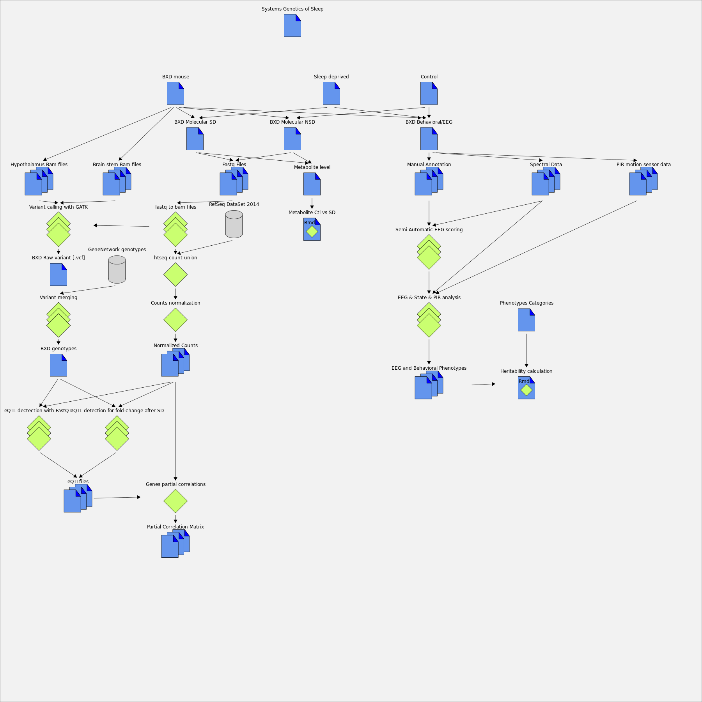

---
title: "BXD MetaData"
output: 
  html_document:
    toc: true
    toc_float: true
    theme: spacelab
    df_print: paged
    rows.print: 6
---

# Project

## Systems Genetics of Sleep

#### Authors

[Maxime Jan](Documentation.html#maxime-jan); [Ioannis Xenarios](Documentation.html#ioannis-xenarios); [Paul Franken](Documentation.html#paul-franken); [Shanaz Diessler](Documentation.html#shanaz-diessler)

#### Link

Link toward our publication: https://www.ncbi.nlm.nih.gov/pubmed/

Vital-IT: https://www.vital-it.ch/

Link toward Franken lab: https://www.unil.ch/cig/en/home/menuinst/research/research-groups/prof-franken.html	

# Author

## Maxime Jan

#### Link

Adress: Maxime.Jan@sib.swiss

## Nicolas Guex

#### Link

Adress: Nicolas.Guex@sib.swiss

## Yann Emmenegger

#### Link

Adress: yann.emmenegger@unil.ch

## Paul Franken

#### Link

Adress: paul.franken@unil.ch

## Ioannis Xenarios

#### Link

Adress: Ioannis.Xenarios@sib.swiss

## Shanaz Diessler

#### Link

Adress: shanaz.diessler@gmail.com

# ReferenceFile

## RefSeq DataSet 2014

#### Description

File that come from UCSC table browser. It was generated using RefSeq Reflat database on the 2014/01/29.

#### Path

SysGenOfSleep_BXDmm9_data.gz/ReferenceFiles/RefSeq_20140129.gtf

#### Link

UCSC table browser: https://genome.ucsc.edu/cgi-bin/hgTables

## GeneNetwork genotypes

#### Description

Genotype from GeneNetwork

#### Path

SysGenOfSleep_BXDmm9_data.gz/ReferenceFiles/GNmm9.Fred.GNformat.geno

#### Version

2001-2016

#### Link

Genenetwork: http://genenetwork.org/webqtl/main.py

## Reference genome

#### Description

Mus_musculus.NCBIM37.67.dna.top.level.fa

# File

## Normalized Counts

### CPM Liver NSD

#### Description

 
The file is generated using [Transcript normalization](Documentation.html#counts-normalization), each row is a [Gene](Documentation.html#refseq-dataset-2014) and each column is a [BXD line](Documentation.html#molecular-data).
 
The tissu come from the [Liver](Documentation.html#liver) during the [Control](Documentation.html#control). Counts are in Count Per Million [CPM]

#### Path

/home/mjan/PhD/GeneExpression/NormalizedExpression/htseq-count_summary.Liver.txt.NSD.CPMnormalizedWITHNSDSD.txt

### CPM Cortex SD

#### Description

 
The file is generated using [Transcript normalization](Documentation.html#counts-normalization), each row is a [Gene](Documentation.html#refseq-dataset-2014) and each column is a [BXD line](Documentation.html#molecular-data).
 
The tissu come from the [Cortex](Documentation.html#cortex) during the [sleep deprivation](Documentation.html#sleep-deprived). Counts are in Count Per Million [CPM]

#### Path

/home/mjan/PhD/GeneExpression/NormalizedExpression/htseq-count_summary.Cortex.txt.SD.CPMnormalizedWITHNSDSD.txt

### CPM Cortex NSD

#### Description

 
The file is generated using [Transcript normalization](Documentation.html#counts-normalization), each row is a [Gene](Documentation.html#refseq-dataset-2014) and each column is a [BXD line](Documentation.html#molecular-data).
 
The tissu come from the [Cortex](Documentation.html#cortex) during the [Control](Documentation.html#control). Counts are in Count Per Million [CPM]

#### Path

/home/mjan/PhD/GeneExpression/NormalizedExpression/htseq-count_summary.Cortex.txt.NSD.CPMnormalizedWITHNSDSD.txt

### CPM Liver SD

#### Description

 
The file is generated using [Transcript normalization](Documentation.html#counts-normalization), each row is a [Gene](Documentation.html#refseq-dataset-2014) and each column is a [BXD line](Documentation.html#molecular-data).
 
The tissu come from the [Liver](Documentation.html#liver) during the [sleep deprivation](Documentation.html#sleep-deprived). Counts are in Count Per Million [CPM]

#### Path

/home/mjan/PhD/GeneExpression/NormalizedExpression/htseq-count_summary.Liver.txt.SD.CPMnormalizedWITHNSDSD.txt

## Transcript raw counts

### Raw Counts in Liver

#### Description

The file is generated using [Htseq-count](Documentation.html#htseq-count-union), each row is a [Gene](Documentation.html#refseq-dataset-2014) and each column is a [BXD line](Documentation.html#molecular-data).
 
The tissu come from the [Liver](Documentation.html#liver) during the [sleep deprivation or sd](Documentation.html#sleep-deprived) and [Control or nsd](Documentation.html#control).

#### Path

/home/mjan/PhD/GeneExpression/RawCounts/RawCounts.Liver.txt

### Raw Counts in Cortex

#### Description

The file is generated using [Htseq-count](Documentation.html#htseq-count-union), each row is a [Gene](Documentation.html#refseq-dataset-2014) and each column is a [BXD line](Documentation.html#molecular-data).
 
The tissu come from the [Cortex](Documentation.html#cortex) during the [sleep deprivation or sd](Documentation.html#sleep-deprived) and [Control or nsd](Documentation.html#control).

#### Path

/home/mjan/PhD/GeneExpression/RawCounts/RawCounts.Cortex.txt

## Fastq Files

### Fastq Liver SD

#### Description

Fastq files from each [BXD lines](Documentation.html#bxd-mouse) generated using Illumina RNA-seq

#### Path

Archived

#### Input

[BXD molecular experiment](Documentation.html#molecular-data)

### Fastq Liver NSD

#### Description

Fastq files from each [BXD lines](Documentation.html#bxd-mouse) generated using Illumina RNA-seq

#### Path

Archived

#### Input

[BXD molecular experiment](Documentation.html#molecular-data)

### Fastq Cortex SD

#### Description

Fastq files from each [BXD lines](Documentation.html#bxd-mouse) generated using Illumina RNA-seq

#### Path

Archived

#### Input

[BXD molecular experiment](Documentation.html#molecular-data)

### Fastq Cortex NSD

#### Description

Fastq files from each [BXD lines](Documentation.html#bxd-mouse) generated using Illumina RNA-seq

#### Path

Archived

#### Input

[BXD molecular experiment](Documentation.html#molecular-data)

## MetaboFiles

### Metabolite level

#### Description

Metabolite level for each [BXD lines](Documentation.html#bxd-mouse)
 
* This file contain Metabolite data for New strains and parental and F1 during [Control](Documentation.html#control) and [Sleep deprivation](Documentation.html#sleep-deprived)
 
* A file containing also old strains is located: /home/mjan/PhD/Rdata/Metabolites_BXD_alldata.txt
 
* Two file containing Mean metabolite values can be found here: /home/mjan/PhD/Rdata/MetabolitesMean.NSD.txt (for control) and /home/mjan/PhD/Rdata/MetabolitesMean.SD.txt (for SD)

#### Path

/home/mjan/PhD/BXD_Paper_Public/Data/Metabolite_BXD.txt

## Bam Files

### Bam Files Cortex NSD

#### Description

Alignement File [Bam] for [Cortex](Documentation.html#cortex) during [Control](Documentation.html#control)

#### Path

frt.el.vital-it.ch:/scratch/cluster/monthly/mjan

## eQTLfiles

### eQTL Cortex NSD

#### Description

eQTL for [Cortex](Documentation.html#cortex) during [Control](Documentation.html#control)
Each row is a [Gene](Documentation.html#refseq-dataset-2014) , first column is the FDR adjusted pvalue using Rpackage qvalue
the last column is a [genetic marker](Documentation.html#bxd-genotypes)

#### Path

/home/mjan/PhD/Rdata/ciseQTL.Cortex.NSD.pvalcorrected.txt

## Partial Correlation Matrix

### Partial correlation matrix, liver SD

#### Path

/scratch/cluster/monthly/mjan/pcor_spearman_LiverSD_LiverSD.Rdata

## Spectral Data

#### Description

Spectral data used for manual annotation and semi-automatic learning approach.
The files are transforme using Fast Fourier transform (FFT). Ask [Yann Emmenegger](Documentation.html#yann-emmenegger) for the processing details.

#### Path

Archived by [Paul Franken](Documentation.html#paul-franken)

## Manual Annotation

#### Description

manually annotated data on the [3rd day of recording (R1)](Documentation.html#bxd-behavioraleeg). Performed by [Yann Emmenegger](Documentation.html#yann-emmenegger). Manual annotation is performed on each mouse of each [BXD lines](Documentation.html#bxd-mouse).

#### Path

Archived by [Paul Franken](Documentation.html#paul-franken)

## PIR motion sensor data

#### Description

PIR motion sensor data recording activity for each mouse of each [BXD lines](Documentation.html#bxd-mouse)

#### Path

Archived by [Paul Franken](Documentation.html#paul-franken)

## Predicted EEG State

#### Description

Predicted state for each [BXD](Documentation.html#bxd-mouse). Prediction for 4 days every 4 seconds (86400 epochs). State are wake [w], NREM sleep [n], REM sleep [r] or artefact value of wake [1], NREM [2] or REM [3]. The 3rd day is replaced by the [manual annotation](Documentation.html#manual-annotation)

#### Path

Archived by [Paul Franken](Documentation.html#paul-franken)

## EEG and Behavioral Phenotypes

#### Description

EEG and Behavioral sleep phenotypes.
Phenotypes contain:
 	 	
* activity
* EEG
* State
 
The directory "Phenotypes/" contains the following information:
 
* [line (BXD lines)](Documentation.html#bxd-mouse)
* mouseID (in format "lines"_"mouseID")
* room (room used for recording)
* rec (recording time period)
* worm (worm detection yes:1 no:0)
* Phenotypes ...
 
A mean value per lines was computed and stored into the following files:
 	
* as text: AllPheno.txt
* as Rdata matrix: SleepPhenotype.Rdata

#### Path

/home/mjan/PhD/Rdata

## Phenotypes Categories

#### Description

Categories for each sleep phenotypes. The categories are related to EEG/State or Activity. The file contain also subcategories and condition related to each phenotypes (can be [bsl](Documentation.html#control), [rec: after sleep deprivation](Documentation.html#sleep-deprived) or $< SD: during sleep deprivation [Sd])	

#### Path

/home/mjan/PhD/Rdata/Phenotype.Categories.txt

## Hypothalamus Bam files

#### Description

RNA-seq aligned read from hypothalamus.
The Data were generated by Bernard Thorens group
Single-End Illumina reads 100bps

#### Path

Archived

#### Input

[BXD mice](Documentation.html#bxd-mouse)

#### Link

Bernard Thorens group: https://www.unil.ch/cig/en/home/menuinst/research/research-groups/prof-thorens.html

## Brain stem Bam files

#### Description

RNA-seq aligned read from brain stem.
The Data were generated by Bernard Thorens group
Single-End Illumina reads 100bps

#### Path

Archived

#### Input

[BXD mice](Documentation.html#bxd-mouse)

#### Link

Bernard Thorens group: https://www.unil.ch/cig/en/home/menuinst/research/research-groups/prof-thorens.html

## BXD Raw variant [.vcf]

#### Description

Raw Variant calling file generated with [GATK](Documentation.html#variant-calling-with-gatk) and annotated using dbsnp

#### Path

/Variants/BXD.PFLiver.PFBrain.BTBrain.Hypo.VariantFiltration.annotated.vcf 

## BXD genotypes

#### Description

Genotype of the BXD using the merge of GeneNetwork and Variant calling

#### Path

/home/mjan/PhD/Rdata/Genotype.FormatedName.geno

## Significant interaction genotype x SD for gene

#### Description

These files contain the significant interaction term between local genotypes and sleep deprivation effect.
The SD effect map significantly on the local region (cis) and the interaction term for genotype effect on SD effect is also significant. 

#### Path

/home/mjan/PhD/Rdata/Genotype_SD_Interaction_Liver.txt & Genotype_SD_Interaction_Cortex.txt

## Significant interaction genotype x SD for metabolite

#### Description

These files contain the significant interaction term between local genotypes and sleep deprivation effect.

#### Path

/home/mjan/PhD/Rdata/Genotype_SD_Interaction_Metabolites.txt

## Significant interaction genotype x SD for phenotypes

#### Description

These files contain the significant interaction term between local genotypes and sleep deprivation effect.

#### Path

/home/mjan/PhD/Rdata/Genotype_SD_Interaction_Phenotypes.txt

# Workflow

## EEG & State & PIR analysis

#### Description

* EEG spectral data analysis for spectral power and spectral gain analysis.
* Activity is measure using PIR motion sensor.
* State concerns Wake [w], NREM[n] and REM[n]

#### Input

[spectral files](Documentation.html#spectral-data); [PIR data](Documentation.html#pir-motion-sensor-data); [Semi-Automatic Annotation](Documentation.html#predicted-eeg-state)

#### Output

[341 Phenotype Data](Documentation.html#eeg-and-behavioral-phenotypes)

#### Authors

[Paul Franken](Documentation.html#paul-franken)

#### Link

Phenotypes full description: Phenotypes.docx

## Semi-Automatic EEG scoring

#### Description

 
* Supervised machine learning approach for EEG annotation.
 
* Multiple SVMs on 1s data resolution
 
* For reinstallation follow the README.txt
 
* Full description of the Workflow available in the README.txt
 
* Main bash script is: Mouse_SleepState_Prediction

#### Path

/data/ul/projects/bxd/PROD-V1.0.1a/

#### Input

[Manually annotated data](Documentation.html#manual-annotation); [Spectral data](Documentation.html#spectral-data)

#### Output

[Predicted Files](Documentation.html#predicted-eeg-state)

#### Version

1.0.1a

#### Authors

[Nicolas Guex](Documentation.html#nicolas-guex); [Maxime Jan](Documentation.html#maxime-jan)

## fastq to bam files

#### Description

transformation of fastq files into bam files. Fastq files are filtered to remove low quality reads. STAR is used for alignment with the [NCBI mm9](Documentation.html#reference-genome) reference genome. Bam are then processed using samtools, piccard and GATK for indexing, add read group, mark duplicates, realign indel, and base recalibration.

#### Path

/home/mjan/PhD/Scripts/

#### Input

[Fastq Files](Documentation.html#fastq-files)

#### Output

[Bam Files](Documentation.html#bam-files)

#### CS

>GenBSUB_Clean_Fastq.py  
generate_STAR_alignement_bsubs_1pass.pl  
generate_STAR_alignement_bsubs.pl  
PreProcessBam.py  

## Variant calling with GATK

#### Description

We use the standard GATK pipeline for variant calling on RNA-sequencing. GenBSUB* scritps generate LSF commands.
As some bam file were aligned on mm9 (NCBI, for sleep data) and other on mm9 (UCSC, for hypothalamus and brainstem)
Some file needed to be reheader (ReheaderFiles.py) and modify chromosome name (chr1 -> 1 RemoveCHR.py) 

#### Path

/home/mjan/PhD/Scripts/

#### Input

[Bam files](Documentation.html#bam-files); [Bam files hypothalamus](Documentation.html#hypothalamus-bam-files); [Bam files BrainStem](Documentation.html#brain-stem-bam-files)

#### Output

[VCF file](Documentation.html#bxd-raw-variant-[vcf])

#### CS

>ReheaderFiles.py  
GenBSUB_CallGenotypeLikelihood.py  
CallGeno.sh  
GenBSUB_GenotypingGVCF.py  
genotyping.sh  

#### Version

GATK: 3.3.0

#### Link

GATK website: https://software.broadinstitute.org/gatk/

## Variant merging

#### Description

Workflow to merge the public genotype available in geneNetwork and variant called using
RNA-sequencing. 
The variant that are highly different from the RNA-seq data are tag as unknown 'U'
The scripts are within Scripts/LowLayer/VariantMerging/
1. First we filter Variant calling file for variant that: pass the GATK filter, have genotype for 90% of BXD, have a quality of 5000
2. the file from RNA-seq and GeneNetwork are combined
3. we get An improbable marker files, containing GeneNework variant discrepency with RNA-seq (see [GetGenotypeRegion.py](Documentation.html#get-genotypes-discrepancy-between-genenetwork-and-rna-seq))
4. ImprobableGNMarkers.txt as 'U' in GeneNetwork file
5. Recombine files
6. Filter for genotypes
7. Rename File
8. Change header to match general BXD name in phenotype files

#### Input

[VCF filtered file](Documentation.html#bxd-raw-variant-[vcf]); [GeneNetwork Genotype](Documentation.html#genenetwork-genotypes)

#### Output

[BXD Genotypes](Documentation.html#bxd-genotypes)

#### CS

>python2 FilterRNAseqVariant.py BXD.PFLiver.PFBrain.BTBrain.Hypo.VariantFiltration.annotated.vcf BXD.PFLiver.PFBrain.BTBrain.Hypo.VariantFiltration.annotated.90pct.5K.vcf  
python2 CombineGenotype.py GNmm9.Fred.GNformat.geno BXD.PFLiver.PFBrain.BTBrain.Hypo.VariantFiltration.annotated.90pct.5K.vcf BXD.PFLiver.PFBrain.BTBrain.Hypo.VariantFiltration.annotated.90pct.5K.geno  
python2 GetGenotypeRegion.py GNmm9.Fred.GNformat.geno BXD.PFLiver.PFBrain.BTBrain.Hypo.VariantFiltration.annotated.90pct.5K.vcf BXD.PFLiver.PFBrain.BTBrain.Hypo.VariantFiltration.annotated.90pct.5K.geno 1 2>ImprobableGNMarkersResults.txt 1>/dev/null  
python2 GetGenotypeRegion.py GNmm9.Fred.GNformat.geno BXD.PFLiver.PFBrain.BTBrain.Hypo.VariantFiltration.annotated.90pct.5K.vcf BXD.PFLiver.PFBrain.BTBrain.Hypo.VariantFiltration.annotated.90pct.5K.geno 2 2>>ImprobableGNMarkersResults.txt 1>/dev/null  
python2 GetGenotypeRegion.py GNmm9.Fred.GNformat.geno BXD.PFLiver.PFBrain.BTBrain.Hypo.VariantFiltration.annotated.90pct.5K.vcf BXD.PFLiver.PFBrain.BTBrain.Hypo.VariantFiltration.annotated.90pct.5K.geno 3 2>>ImprobableGNMarkersResults.txt 1>/dev/null  
python2 GetGenotypeRegion.py GNmm9.Fred.GNformat.geno BXD.PFLiver.PFBrain.BTBrain.Hypo.VariantFiltration.annotated.90pct.5K.vcf BXD.PFLiver.PFBrain.BTBrain.Hypo.VariantFiltration.annotated.90pct.5K.geno 4 2>>ImprobableGNMarkersResults.txt 1>/dev/null  
python2 GetGenotypeRegion.py GNmm9.Fred.GNformat.geno BXD.PFLiver.PFBrain.BTBrain.Hypo.VariantFiltration.annotated.90pct.5K.vcf BXD.PFLiver.PFBrain.BTBrain.Hypo.VariantFiltration.annotated.90pct.5K.geno 5 2>>ImprobableGNMarkersResults.txt 1>/dev/null  
python2 GetGenotypeRegion.py GNmm9.Fred.GNformat.geno BXD.PFLiver.PFBrain.BTBrain.Hypo.VariantFiltration.annotated.90pct.5K.vcf BXD.PFLiver.PFBrain.BTBrain.Hypo.VariantFiltration.annotated.90pct.5K.geno 6 2>>ImprobableGNMarkersResults.txt 1>/dev/null  
python2 GetGenotypeRegion.py GNmm9.Fred.GNformat.geno BXD.PFLiver.PFBrain.BTBrain.Hypo.VariantFiltration.annotated.90pct.5K.vcf BXD.PFLiver.PFBrain.BTBrain.Hypo.VariantFiltration.annotated.90pct.5K.geno 7 2>>ImprobableGNMarkersResults.txt 1>/dev/null  
python2 GetGenotypeRegion.py GNmm9.Fred.GNformat.geno BXD.PFLiver.PFBrain.BTBrain.Hypo.VariantFiltration.annotated.90pct.5K.vcf BXD.PFLiver.PFBrain.BTBrain.Hypo.VariantFiltration.annotated.90pct.5K.geno 8 2>>ImprobableGNMarkersResults.txt 1>/dev/null  
python2 GetGenotypeRegion.py GNmm9.Fred.GNformat.geno BXD.PFLiver.PFBrain.BTBrain.Hypo.VariantFiltration.annotated.90pct.5K.vcf BXD.PFLiver.PFBrain.BTBrain.Hypo.VariantFiltration.annotated.90pct.5K.geno 9 2>>ImprobableGNMarkersResults.txt 1>/dev/null  
python2 GetGenotypeRegion.py GNmm9.Fred.GNformat.geno BXD.PFLiver.PFBrain.BTBrain.Hypo.VariantFiltration.annotated.90pct.5K.vcf BXD.PFLiver.PFBrain.BTBrain.Hypo.VariantFiltration.annotated.90pct.5K.geno 10 2>>ImprobableGNMarkersResults.txt 1>/dev/null  
python2 GetGenotypeRegion.py GNmm9.Fred.GNformat.geno BXD.PFLiver.PFBrain.BTBrain.Hypo.VariantFiltration.annotated.90pct.5K.vcf BXD.PFLiver.PFBrain.BTBrain.Hypo.VariantFiltration.annotated.90pct.5K.geno 11 2>>ImprobableGNMarkersResults.txt 1>/dev/null  
python2 GetGenotypeRegion.py GNmm9.Fred.GNformat.geno BXD.PFLiver.PFBrain.BTBrain.Hypo.VariantFiltration.annotated.90pct.5K.vcf BXD.PFLiver.PFBrain.BTBrain.Hypo.VariantFiltration.annotated.90pct.5K.geno 12 2>>ImprobableGNMarkersResults.txt 1>/dev/null  
python2 GetGenotypeRegion.py GNmm9.Fred.GNformat.geno BXD.PFLiver.PFBrain.BTBrain.Hypo.VariantFiltration.annotated.90pct.5K.vcf BXD.PFLiver.PFBrain.BTBrain.Hypo.VariantFiltration.annotated.90pct.5K.geno 13 2>>ImprobableGNMarkersResults.txt 1>/dev/null  
python2 GetGenotypeRegion.py GNmm9.Fred.GNformat.geno BXD.PFLiver.PFBrain.BTBrain.Hypo.VariantFiltration.annotated.90pct.5K.vcf BXD.PFLiver.PFBrain.BTBrain.Hypo.VariantFiltration.annotated.90pct.5K.geno 14 2>>ImprobableGNMarkersResults.txt 1>/dev/null  
python2 GetGenotypeRegion.py GNmm9.Fred.GNformat.geno BXD.PFLiver.PFBrain.BTBrain.Hypo.VariantFiltration.annotated.90pct.5K.vcf BXD.PFLiver.PFBrain.BTBrain.Hypo.VariantFiltration.annotated.90pct.5K.geno 15 2>>ImprobableGNMarkersResults.txt 1>/dev/null  
python2 GetGenotypeRegion.py GNmm9.Fred.GNformat.geno BXD.PFLiver.PFBrain.BTBrain.Hypo.VariantFiltration.annotated.90pct.5K.vcf BXD.PFLiver.PFBrain.BTBrain.Hypo.VariantFiltration.annotated.90pct.5K.geno 16 2>>ImprobableGNMarkersResults.txt 1>/dev/null  
python2 GetGenotypeRegion.py GNmm9.Fred.GNformat.geno BXD.PFLiver.PFBrain.BTBrain.Hypo.VariantFiltration.annotated.90pct.5K.vcf BXD.PFLiver.PFBrain.BTBrain.Hypo.VariantFiltration.annotated.90pct.5K.geno 17 2>>ImprobableGNMarkersResults.txt 1>/dev/null  
python2 GetGenotypeRegion.py GNmm9.Fred.GNformat.geno BXD.PFLiver.PFBrain.BTBrain.Hypo.VariantFiltration.annotated.90pct.5K.vcf BXD.PFLiver.PFBrain.BTBrain.Hypo.VariantFiltration.annotated.90pct.5K.geno 18 2>>ImprobableGNMarkersResults.txt 1>/dev/null  
python2 GetGenotypeRegion.py GNmm9.Fred.GNformat.geno BXD.PFLiver.PFBrain.BTBrain.Hypo.VariantFiltration.annotated.90pct.5K.vcf BXD.PFLiver.PFBrain.BTBrain.Hypo.VariantFiltration.annotated.90pct.5K.geno 19 2>>ImprobableGNMarkersResults.txt 1>/dev/null  
python2 GetGenotypeRegion.py GNmm9.Fred.GNformat.geno BXD.PFLiver.PFBrain.BTBrain.Hypo.VariantFiltration.annotated.90pct.5K.vcf BXD.PFLiver.PFBrain.BTBrain.Hypo.VariantFiltration.annotated.90pct.5K.geno X 2>>ImprobableGNMarkersResults.txt 1>/dev/null  
python2 GN_Correction.py GNmm9.Fred.GNformat.geno ImprobableGNMarkersResults.txt GNmm9.Fred.GNformat.GNCorrected.geno  
python2 CombineGenotype.py GNmm9.Fred.GNformat.GNCorrected.geno BXD.PFLiver.PFBrain.BTBrain.Hypo.VariantFiltration.annotated.90pct.5K.vcf BXD.PFLiver.PFBrain.BTBrain.Hypo.VariantFiltration.annotated.90pct.5K.GNCorrected.geno  
python2 CombineGenotype.py GNmm9.Fred.GNformat.GNCorrected.geno BXD.PFLiver.PFBrain.BTBrain.Hypo.VariantFiltration.annotated.90pct.5K.vcf BXD.PFLiver.PFBrain.BTBrain.Hypo.VariantFiltration.annotated.90pct.5K.GNCorrected.geno  
python2 CombineGenotypeV2.py GNmm9.Fred.GNformat.GNCorrected.geno BXD.PFLiver.PFBrain.BTBrain.Hypo.VariantFiltration.annotated.90pct.5K.vcf BXD.PFLiver.PFBrain.BTBrain.Hypo.VariantFiltration.annotated.90pct.5K.GNCorrected.geno > BXD.PFLiver.PFBrain.BTBrain.Hypo.VariantFiltration.annotated.90pct.5K.GNCorrected.FiltSNPs.geno  
mv BXD.PFLiver.PFBrain.BTBrain.Hypo.VariantFiltration.annotated.90pct.5K.GNCorrected.FiltSNPs.geno Genotype.geno  
GenotypeHeaderChange.py Genotype.geno Genotype.FormatedName.geno  

## eQTL dectection with FastQTL

#### Description

Generation of cis-eQTL files using FastQTL, the complete workflow is empacked using the Rmarkdown cis_eQTL_Analysis.Rmd.

#### Path

/home/mjan/PhD/Analysis/cis-eQTL_Detection/cis_eQTL_Analysis.Rmd

#### Input

[Normalized counts](Documentation.html#normalized-counts); [Genotypes](Documentation.html#bxd-genotypes)

#### Output

[eQTL files](Documentation.html#eqtlfiles)

#### CS

>GenoToVcf.py  
bgzip & tabix  
Create_BED_UCSC.py  
bgzip & tabix  
ciseQTLAnalysis.sh  
Compute qvalue  

#### Version

fastQTL.1.165.linux

#### Link

FastQTL: http://fastqtl.sourceforge.net/

## eQTL detection for fold-change after SD

#### Description

 
Generation of cis-eQTL files using FastQTL, the complete workflow is empacked using the Rmarkdown cis_FC_eQTL_Analysis.Rmd.	
 
Same pipeline as [standard cis-eQTL](Documentation.html#eqtl-dectection-with-fastqtl) but using fold-change

#### Path

/home/mjan/PhD/Analysis/cis-eQTL_Detection/cis_FC_eQTL_Analysis.Rmd

#### Input

[Normalized counts](Documentation.html#normalized-counts); [Genotypes](Documentation.html#bxd-genotypes)

#### Output

[eQTL files](Documentation.html#eqtlfiles)

#### CS

>Fold-change calculation  
GenoToVcf.py  
bgzip & tabix  
Create_BED_UCSC.py  
bgzip & tabix  
ciseQTLAnalysis.sh  
Compute qvalue	  

#### Version

fastQTL.1.165.linux

#### Link

FastQTL: http://fastqtl.sourceforge.net/

# Script

## Counts normalization

#### Description

Script used for transcript normalization using edgeR

#### Path

/home/mjan/PhD/Scripts/Normalization.R

#### Input

[Raw counts](Documentation.html#transcript-raw-counts)

#### Output

[Normalized counts](Documentation.html#normalized-counts)

## htseq-count union

#### Description

 
* Script to generate count file from multiple bam file alignment, generate LSF command
 
* The counts were merge using MergeCount.py

Script take as input a list of the processed bam file

#### Path

/home/mjan/PhD/Scripts/GenBSUB_htseq-count.py

#### Input

[Bam Files](Documentation.html#bam-files); [RefSeq file](Documentation.html#refseq-dataset-2014)

#### Output

[Raw counts](Documentation.html#transcript-raw-counts)

#### Arguments

-q -s reverse -t exon -m union

#### Version

0.5.4p3

## Genes partial correlations

#### Description

A Rscript to generate a partial correlation matrix.
 
* Example using the script to compute pcor for gene in cortex during Control (Cortex NSD vs Cortex NSD): Matrix<-BXDpcor(CNSD,cis_CNSD,CNSD,cis_CNSD,GenotypeMatrix,CORES=30,method="pearson")
 
* The input file (Expression matrix: CNSD and cis-eQTL matrix: cis_CNSD) need to be formated to contain the same gene, You can see an example here: /home/mjan/PhD/Analysis/Partial_Correlation/GetPartialCorrelationForBXD.R
 
* The method can be "spearman" or "pearson"
* "parallel","reshape2","matrixStats" and "RcppEigen" packages are required
* If you want to change between interaction or additive effect, edit model matrix in the CorResiduals() function

#### Path

/home/mjan/PhD/Scripts/BXDpcor_V1.0.1.R

#### Input

[Expression Data](Documentation.html#normalized-counts); [cis-eQTL File](Documentation.html#eqtlfiles)

#### Output

[Partial correlation Matrix](Documentation.html#partial-correlation-matrix)

#### Version

1.0.1

## Get Genotypes Discrepancy between GeneNetwork and RNA-seq

#### Description

The script display as output the genotypes for the chromosome given in argument 4.
Argument 1 is path to GeneNetwork genotypes
Argument 2 is path to RNA-seq genotypes
Argument 3 is path to combined file (see [Workflow merging](Documentation.html#variant-merging))
C57BL6/J genotypes are display as 'B'
DBA2/J genotypes are display as 'D'
Heterozygous genotypes are display as 'H'
Genotypes in green are RNA-seq variant
Genotypes in blue are GeneNetwork variant
Discrepancy in BXD lines are display as red genotypes and writing into stderr
Discrepancy are GeneNetwork genotypes surrounded by the other genotypes (B surrounded by D) in a window of 2Mb without any similar genotypes
You can edit the script to see smaller region

# Population

## BXD mouse

#### Description

Used to generate [Molecular data](Documentation.html#molecular-data) and [Behavioral data](Documentation.html#bxd-behavioraleeg)   

# Tissu

## Cortex

#### Description

Cortex sample extracted for RNA-seq sequencing

## Liver

#### Description

Liver sample extracted for RNA-seq sequencing

## Blood Metabolism

#### Description

Blood Metabolism quantification

# Condition

## Control

#### Description

Control sample from the [BXD](Documentation.html#bxd-mouse) Experiments

## Sleep deprived

#### Description

6h of sleep deprivation during the 3rd day of recording during the first our of light phase [ZT0-6]

# Rmarkdown

## Genotype-SD interaction for transcript

#### Description

 	 
A limma pipeline that test if a gene fold-change after [sleep deprivation](Documentation.html#sleep-deprived) that was map locally (using [cis-eQTL fold-change](Documentation.html#eqtl-detection-for-fold-change-after-sd)) 
has a significant interaction term.
 		
The pipeline use the following linear model: Gene Level = Genotype * Condition

#### Path

/home/mjan/PhD/Analysis/Allelic_Differential_Expression/Allelic_Differential_Expression_Final.Rmd

#### Input

[Raw counts](Documentation.html#transcript-raw-counts); [Genotypes](Documentation.html#bxd-genotypes); $<cis-eQTL fold-change [FC_FastQTL] >

#### Output

[Genotype SD significant interaction](Documentation.html#significant-interaction-genotype-x-sd-for-gene)

## Genotype-SD interaction for metabolite

#### Description

 
An ANOVA pipeline that test if a metabolite fold-change after [sleep deprivation](Documentation.html#sleep-deprived) that was map locally (using mQTL) 
has a significant interaction term.
  
As we have independent measurement between condition and multiple value for each BXD lines, we use the following linear model
 
The pipeline use the following nested linear model: Metabolite Level = Genotype/BXDLines + Genotype * Condition

#### Path

/home/mjan/PhD/BXD_Paper_Public/Analysis/Differential_Expression_Metabolites_FC.Rmd

#### Input

[Metabolite level](Documentation.html#metabolite-level); [Genotypes](Documentation.html#bxd-genotypes); mQTL

#### Output

[Genotype SD significant interaction](Documentation.html#significant-interaction-genotype-x-sd-for-metabolite)

## Genotype-SD interaction for phenotypes

#### Description

 
A mixed model pipeline that test if a phenotypes fold-change after [sleep deprivation](Documentation.html#sleep-deprived) that was map locally (using ph-QTL) 
has a significant interaction term.
As we have dependent measurement between condition and multiple value for each BXD lines, we use the following linear mixed model (we didn't use lines as fixed effect to reduce
the number of parameter used in our model)
 
The pipeline use the following linear mixed model: Phenotypes Level => fixed effect: Genotype * Condition; random effect: Mouse individual, we model a different intercept
for different mouse.
(using lmer: Phenotype ~ Genotype * Condition + (1|mID)) 

#### Path

/home/mjan/PhD/Analysis/SDEffectOnPhenotypes/SDeffectOnPhenotype_FCdiff.Rmd

#### Input

[Phenotype data](Documentation.html#eeg-and-behavioral-phenotypes); [Genotypes](Documentation.html#bxd-genotypes); ph-QTL

#### Output

[Genotype SD significant interaction](Documentation.html#significant-interaction-genotype-x-sd-for-phenotypes)

## Heritability calculation

#### Description

Rmarkdown for heritability calculation, details in the Rmarkdown

#### Path

/home/mjan/PhD/BXD_Paper_Figures/Heritability.html

#### Input

[Sleep phenotypes](Documentation.html#eeg-and-behavioral-phenotypes); [Sleep categories](Documentation.html#phenotypes-categories)

## Metabolite Ctl vs SD

#### Description

Rmarkdown for differential metabolite level, details in the Rmarkdown

#### Path

/home/maxime/Link_To_Cluster/BXD_Paper_Public/Analysis/Differential_Expression_Metabolites.html

#### Input

[Metabolite level](Documentation.html#metabolite-level)

# Experiment

## Molecular data

### BXD Molecular SD

#### Description

BXD cohort for molecular quantification after sleep deprivation

#### Input

[BXD](Documentation.html#bxd-mouse); [Sleep Deprivation](Documentation.html#sleep-deprived); [Cortex](Documentation.html#cortex); [Liver](Documentation.html#liver); [Blood](Documentation.html#blood-metabolism)

#### Output

[fastq files Cortex SD](Documentation.html#fastq-cortex-sd); [fastq files Liver SD](Documentation.html#fastq-liver-sd); [Metabolite level](Documentation.html#metabolite-level)

### BXD Molecular NSD

#### Description

BXD cohort for molecular quantification after sleep deprivation

#### Input

[BXD](Documentation.html#bxd-mouse); [Control](Documentation.html#control); [Cortex](Documentation.html#cortex); [Liver](Documentation.html#liver); [Blood](Documentation.html#blood-metabolism)

#### Output

[fastq files Liver Control](Documentation.html#fastq-liver-nsd); [fastq files Cortex Control](Documentation.html#fastq-cortex-nsd); [Metabolite level](Documentation.html#metabolite-level)

## BXD Behavioral/EEG

#### Description

Generation of data for EEG and behavioral phenotypes.
The [BXD](Documentation.html#bxd-mouse) are recorded for 4 days under light and dark condition. The 3rd day, mice underwent 6h of [sleep deprivation](Documentation.html#sleep-deprived). The recording follow-up for 2 day (recovery).
The 2 days of baseline are considered as [Control](Documentation.html#control) and the 2 days of recorvery are considered as the condition [sleep deprivted](Documentation.html#sleep-deprived)	

#### Input

[BXD](Documentation.html#bxd-mouse); [Control](Documentation.html#control); [Sleep deprivation](Documentation.html#sleep-deprived)

#### Output

[EEG Spectral Data](Documentation.html#spectral-data); [PIR motion Data](Documentation.html#pir-motion-sensor-data); [EEG manula annotation](Documentation.html#manual-annotation)

